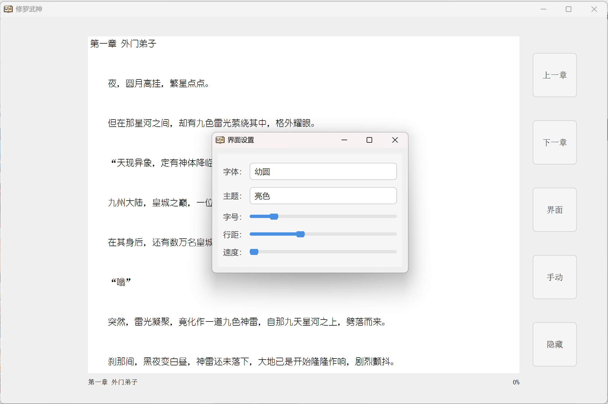

# 📚 Novel Reader — 轻量级免费小说阅读器


一个基于 **Qt Widgets (Qt 5.14.2 MinGW)** 编写的简洁、稳定、可扩展的网络小说阅读器。  
支持 阅读、自动滚动、阅读设置、进度记忆、行距/字体调节等功能，界面干净易用。

---

## 🖼️ 预览界面

### 📌 主界面


---

### 📌 小说阅读页面



---

## ✨ 功能特点

- **自动滚动（支持 ON/OFF 及 F5 快捷键）**
- **TXT 小说阅读 + UTF-8 自动识别**
- **记住阅读位置、字体、字号、行距、背景色等设置**
- **进度显示**
- **窗口大小、位置自动记忆**
- **支持快捷键快速调整阅读体验**
- **UI 简洁，纯 Qt 原生，无额外依赖库**

---

## ⌨️ 快捷键说明

| 快捷键 | 功能 |
|-------|------|
| **F5** | 自动滚动开关 |
| **F4** | 老板键 |
| **F7** | 阅读工具栏开关 |
| **← / →** | 切换章节 |
| **↑ / ↓** | 上下翻页 |

---

## 🚀 使用方法

1. 运行程序后，第一次自动获取域名，失效后点击按钮自动获取域名。
2. 阅读时可随时：  
   - 调整字体  
   - 改变行距  
   - 切换背景色  
   - 开启自动滚动  
3. 所有设置会自动保存，下次打开自动恢复。

---

## 🛠️ 技术栈

- **Qt 5.14.2（MinGW 7.3.0）**
- **Qt Widgets / QSettings / QTextBrowser**
- **C++11**
- **qmake（.pro 项目）**
- **SSL**

---

## 🧪 打包说明（Windows）

使用 Qt 自带工具：

```bash
windeployqt --release Novel_Book.exe
添加dll文件夹中两个dll文件到exe文件旁边
